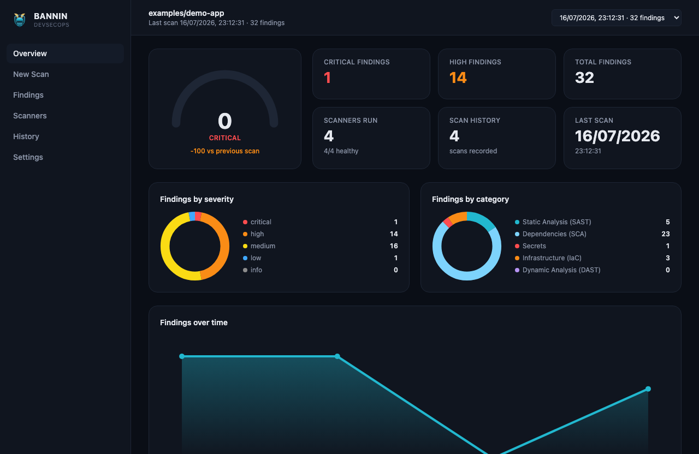
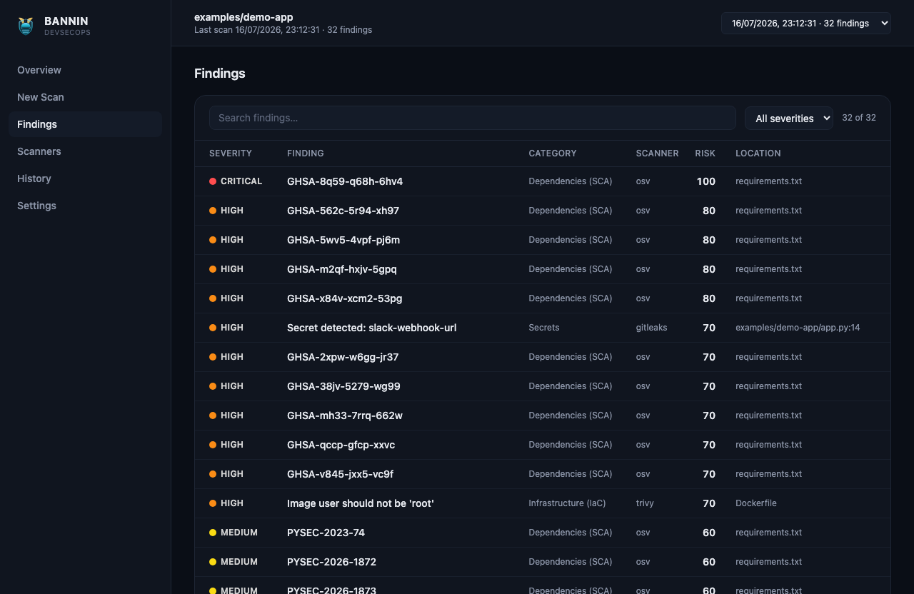

<p align="center">
  
</p>

<h1 align="center">BANNIN</h1>
<p align="center"><b>Run your security scanners. See everything in one place.</b></p>

<p align="center">
  
  
</p>

---

BANNIN wraps the security scanners you already use — Semgrep, Trivy, OSV
Scanner, Gitleaks, Checkov, and OWASP ZAP — behind one command and one
dashboard. Instead of six tools with six output formats, you get one
findings list: deduplicated, risk-scored, and browsable.

- **One command to scan** — `bannin scan` runs every configured scanner,
  merges the results, and gives you a pass/fail exit code for CI.
- **One dashboard to browse** — a live web UI with a security score,
  a searchable findings table, scan history, and per-scanner status.
- **No duplicate noise** — the same vulnerability flagged by two
  scanners shows up once, not twice.
- **Scan from the browser** — paste a URL or a path into the dashboard
  and run a scan on demand, no config editing required.
- **CI-friendly reports** — a single self-contained HTML file, plus
  JSON for tooling.

## Get started in two commands

```bash
git clone https://github.com/JPtheDash/BANNIN-.git
cd BANNIN-

./scripts/install-tools.sh   # installs the scanners (Semgrep, Trivy, OSV Scanner, Gitleaks, Checkov, ZAP)
./scripts/start-web.sh       # builds BANNIN and opens the dashboard
```

That's it — the dashboard opens at `http://localhost:5173`. Run a scan
from the **New Scan** page, or from the CLI:

```bash
./bin/bannin scan
```

Ctrl+C stops everything. Both scripts are safe to re-run.

## Using it in CI/CD

Add `bannin scan` as a step in your pipeline. It exits non-zero when a
finding breaches your policy, so it works as a merge gate out of the box.

```yaml
- run: go build -o bin/bannin ./cmd/bannin
- run: ./scripts/install-tools.sh --ci --skip-zap
- run: ./bin/bannin scan --config bannin.yaml
- uses: actions/upload-artifact@v4
  if: always()
  with:
    name: bannin-report
    path: bannin-report/
```

That last step matters — upload the report even on failure, so a blocked
build still gives you something to look at. `bannin-report/report.html`
is a single self-contained file, safe to open from CI artifacts anywhere.

## Using the dashboard

`./scripts/start-web.sh` starts everything for you. If you'd rather run
the pieces yourself:

```bash
bannin scan --config bannin.yaml      # produces at least one scan
bannin serve --config bannin.yaml     # starts the API
cd web && npm install && npm run dev  # starts the dashboard
```

The dashboard shows a security score, severity and category breakdowns,
scan history, a searchable findings table with full detail per finding,
and the health of each scanner. You can also kick off new scans directly
from the browser — paste a target, pick scanners (or let it choose),
and watch the result land.

Set `server.auth_token` in your config (or the `BANNIN_AUTH_TOKEN` env
var) if the dashboard is reachable by anyone you don't trust.

## Configuration

Everything is one YAML file. A minimal one:

```yaml
scan:
  target: "."
  plugins: [semgrep, osv, trivy, gitleaks]

policy:
  fail_on_severity: "high"

storage:
  driver: "sqlite"
  dsn: "./bannin.db"
```

See [`configs/bannin.example.yaml`](configs/bannin.example.yaml) for the
full set of options.

## Docker

```bash
docker build -t bannin -f docker/Dockerfile .
docker run --rm bannin version
```

## License

No license file yet — check with the maintainer before redistributing.
